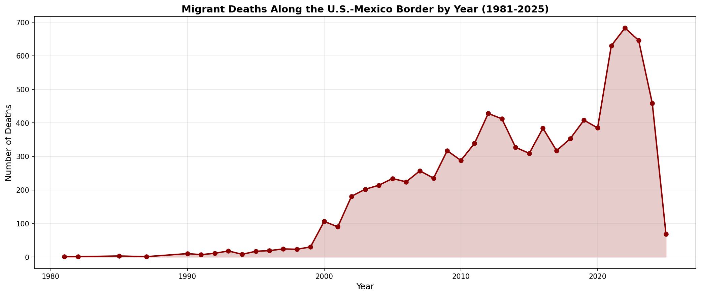
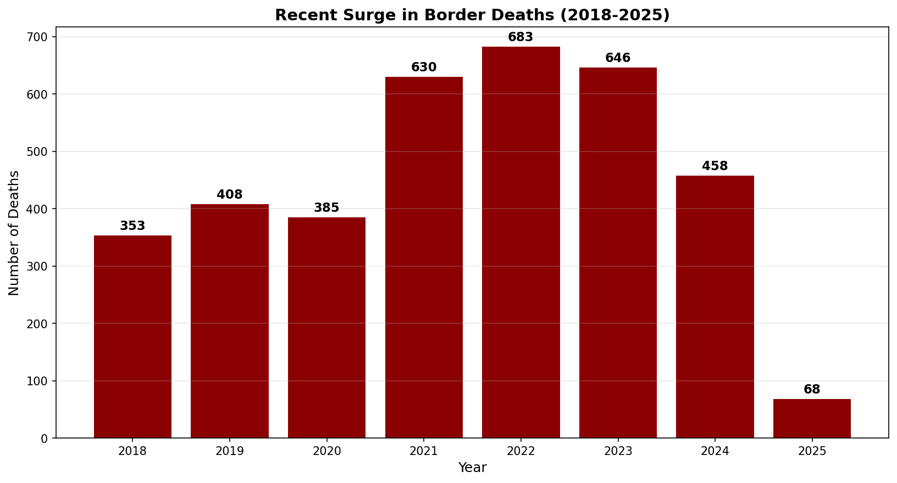
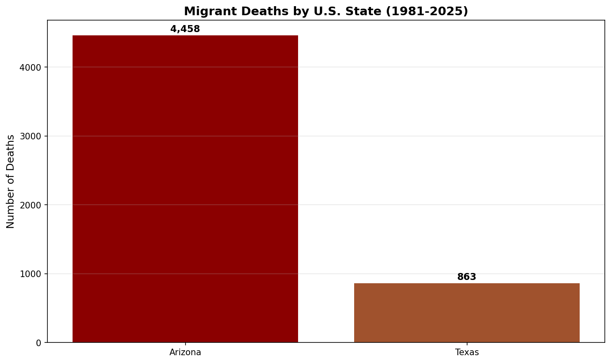
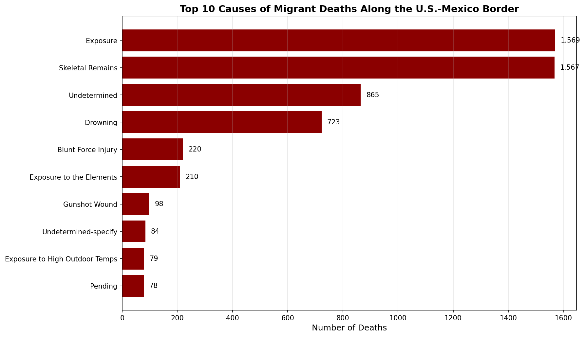
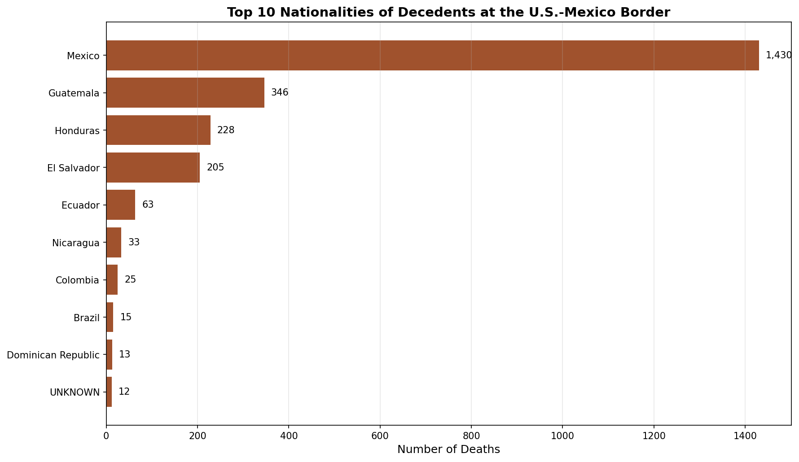

# Migrant Deaths Along the U.S.-Mexico Border: A Data Analysis

A Malloy data analysis project investigating migrant death patterns across the
entire U.S.-Mexico border using the No More Deaths Border Death Database. This
project explores 8,832 recorded deaths spanning 44 years and surfaces concrete
insights intended to support humanitarian search efforts and broader awareness
of one of the most significant ongoing humanitarian crises in the United States.

---

## Overview

The No More Deaths Border Death Database compiles records of recovered migrant
remains across the southern U.S. border from 2002 to 2025, drawing on data from
ten different county medical examiner offices, sheriff's departments, and Border
Patrol records. After standardizing and combining the data into one master
dataset, this analysis revealed dramatic geographic, temporal, and demographic
patterns that point to the scale of the crisis and the gaps in identification
that continue to leave thousands of families searching for their loved ones.

---

## The Story

### A Crisis That Has Surged in Recent Years

The dataset spans from 1981 to early 2025, and what immediately stands out is
the dramatic increase in recorded deaths beginning in the early 2000s and
surging again in the past five years. The deadliest year on record was 2022
with 683 deaths, followed by 2023 with 646 and 2021 with 630. Even early 2025
is on pace for another devastating year, with 68 deaths recorded in just the
first few months alone.

### Arizona Carries the Heaviest Burden

Arizona accounts for 4,636 of the 8,832 recorded deaths in this dataset,
followed by Texas with 3,037 and California with 799. Pima County Arizona
alone is responsible for 3,377 deaths once both spellings of the county name
are combined, making it the single deadliest county in the dataset by a
substantial margin.

### Causes of Death Tell a Sobering Story

The two leading findings in the dataset are nearly tied: 1,569 deaths
attributed to environmental exposure and 1,567 cases recorded only as skeletal
remains. The skeletal remains figure is particularly devastating, because it
means those bodies were not discovered until long after death, with no chance
of timely recovery or precise identification. Together, exposure and skeletal
remains account for over 35 percent of all recorded deaths, telling the story
of migrants dying in the desert and lying undiscovered for weeks, months, or
years.

### Who Is Dying

Mexican nationals account for the largest portion of identified decedents at
1,430, followed by Guatemala with 346, Honduras with 228, and El Salvador
with 205. The presence of Central American nationalities in such high numbers
reflects the patterns of recent migration, where families and individuals are
traveling thousands of miles north only to die at the final geographic barrier.

---

## The Identification Crisis

One of the most striking findings of this analysis is how often basic
information about decedents is unknown. Of the 8,832 recorded deaths, only
4,881 had a known age at time of death, meaning 45 percent of all decedents
were too decomposed, skeletal, or otherwise unidentifiable to determine even
something as fundamental as how old they were. While 7,324 cases (83 percent)
do have GPS coordinates recorded, those coordinates often mark a recovery
location rather than a death site, and the gap between when a person died
and when their remains were found can stretch into years.

---

## What I Learned

What surprised me most about this project was the sheer scope of the
identification gap. Going into this analysis I expected to find that some
records were incomplete, but I did not expect that nearly half of all recorded
deaths would have unknown ages, or that skeletal remains would account for
nearly the same number of deaths as exposure itself. These two findings
together paint a picture of a humanitarian crisis where the difficulty of
recovery and identification compounds the original tragedy. Families never
receive answers, decedents are buried as Jane and John Does, and the true
scale of loss is impossible to fully measure.

What was harder than expected was navigating the inconsistencies in the source
data. The original Excel file contained 13 separate sheets, each with
different column structures, formats, and conventions. Some county records
were detailed and standardized, while others were sparse or used non-numeric
entries like "Est. 17" or "Unknown" in fields meant for ages. Cleaning and
standardizing this data into one usable master file required several rounds
of error handling and manual mapping, but the result is a dataset that can
now be queried freely in Malloy and used to surface real insights.

---

## Sample Insight

A query of the deadliest counties shows that Pima County Arizona accounts for
the single largest concentration of deaths in the entire dataset, with over
3,300 recorded cases when accounting for variations in capitalization. This
geographic concentration aligns with the most extreme stretches of the Sonoran
Desert, where summer temperatures regularly exceed 110 degrees Fahrenheit and
where humanitarian organizations like Humane Borders and No More Deaths
maintain water stations and conduct search and rescue operations.

---

## How to Run This Analysis

1. Clone this repository: https://github.com/dprieto-robles/border-deaths-malloy.git

2. Open the project folder in VS Code with the Malloy extension installed

3. Open the `border_deaths.malloy` file

4. Run any of the views by clicking the play button above any `run:` statement

---

## Who Would Care

This dataset and analysis is intended to support several audiences. **Search
and recovery organizations** can use the geographic concentrations and
location data to focus their efforts where deaths are most clustered.
**Humanitarian aid groups** can use the cause-of-death patterns to identify
where water drops and emergency supplies are most needed. **Journalists and
researchers** can use the temporal trends to contextualize the recent surge
in deaths and connect it to changes in border policy and migration patterns.
And **families searching for missing loved ones** may find some comfort, or
at least a path forward, in knowing that ongoing identification work is
documented and trackable through datasets like this one. The fact that
1,653 decedents in Arizona alone remain unidentified as of February 2026 is
a reminder that this is not just historical data — it is a living crisis
that demands continued attention, resources, and care.

---

## Data Source

This analysis is built on the No More Deaths Border Death Database, which
compiles data from county medical examiner offices, sheriff's departments,
and Border Patrol records across the southern U.S. border. The original
dataset is available at nomoredeaths.org and represents the most comprehensive
public record of recovered migrant remains currently available.
